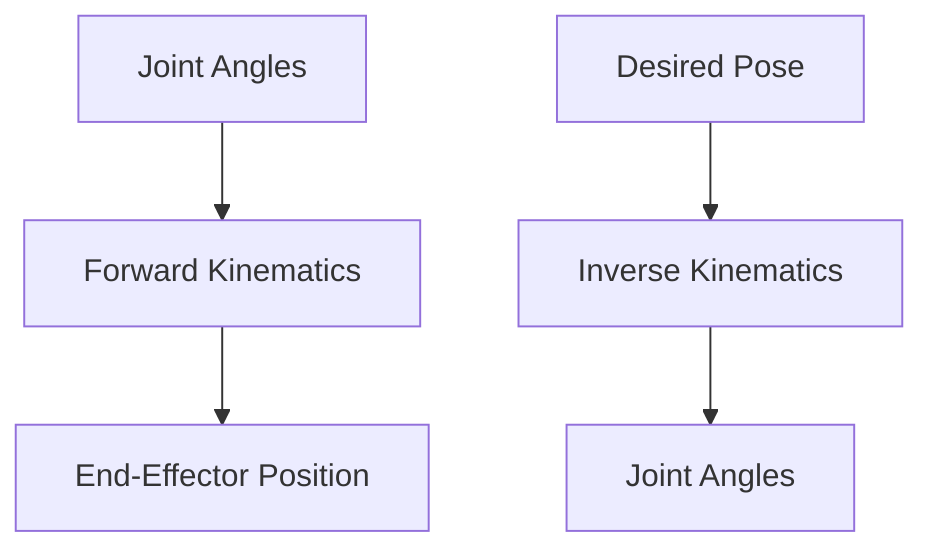

# Chapter 02: Basics of Humanoid Robotics

## Introduction

Humanoid robotics focuses on creating robots that mimic human form and behavior to interact effectively in human-centric environments. These robots typically feature two arms, two legs, a torso, and a head, enabling tasks like walking, grasping, and communication. As of 2023, advancements in AI, sensors, and materials have propelled humanoid robots from research labs to practical applications in manufacturing, healthcare, and exploration.

*Figure 1: Basic structure of a humanoid robot, highlighting key components.*

## Humanoid Robot Anatomy

Humanoid robots replicate human skeletal and muscular systems through mechanical joints and actuators. Key anatomical features include:

- **Degrees of Freedom (DOF):** Humanoids often have 20-30 DOF, distributed across limbs for flexibility.
- **Joints:** Revolute and prismatic joints mimic human articulations.
- **Actuators:** Electric motors, hydraulics, or pneumatics provide movement.

| Component | Typical DOF | Function |
|-----------|-------------|----------|
| Head | 2-3 | Orientation and sensing |
| Arms (per arm) | 7 | Manipulation and reaching |
| Legs (per leg) | 6 | Locomotion and balance |
| Torso | 1-3 | Stability and posture |

*Figure 2: Degrees of freedom in humanoid joints.*

## Kinematics and Dynamics

- **Forward Kinematics:** Calculates end-effector position from joint angles.
- **Inverse Kinematics:** Determines joint angles for desired end-effector pose.
- **Dynamics:** Models forces, torques, and energy for motion planning.

*Flow Diagram 1: Kinematics computation flow.*

## Control Systems

Control involves hierarchical layers: high-level planning (AI-based), mid-level coordination, and low-level servo control. Modern systems integrate reinforcement learning for adaptive behaviors.

## Locomotion and Balance

Humanoid walking uses Zero Moment Point (ZMP) for stability. Bipedal gait cycles include stance and swing phases, with feedback from inertial sensors.

## Perception and Sensors

Sensors include cameras, LIDAR, IMUs, and force/torque sensors for environment awareness and proprioception.

## Challenges and Future Directions

Challenges include energy efficiency, robustness, and human-robot interaction. Future trends involve soft robotics, brain-computer interfaces, and swarm coordination.

Recent developments (2023): Companies like Boston Dynamics and Tesla are deploying humanoids in real-world tasks, with AI enabling more autonomous operations.
