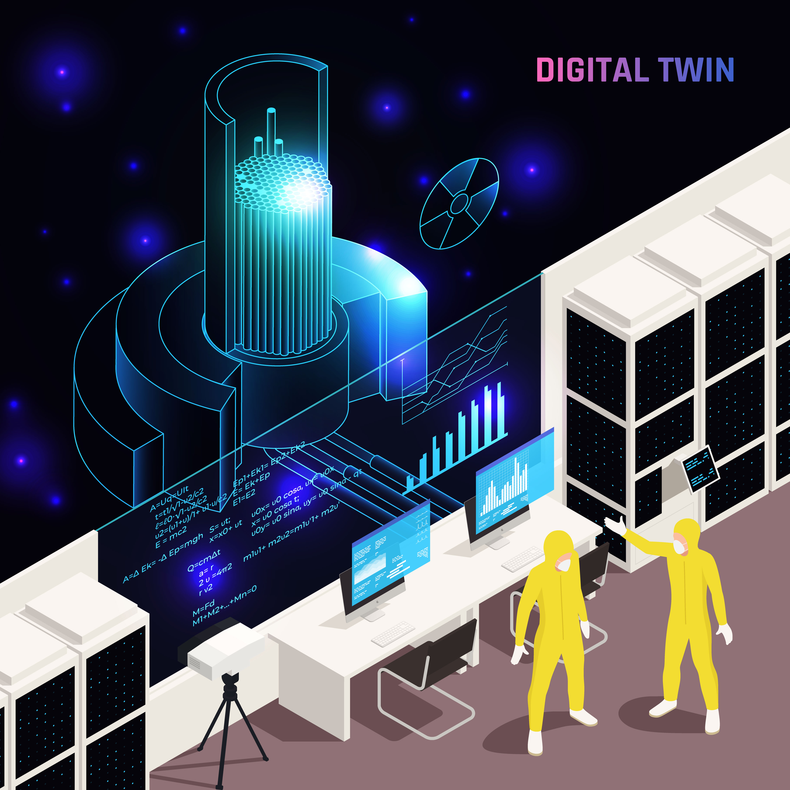
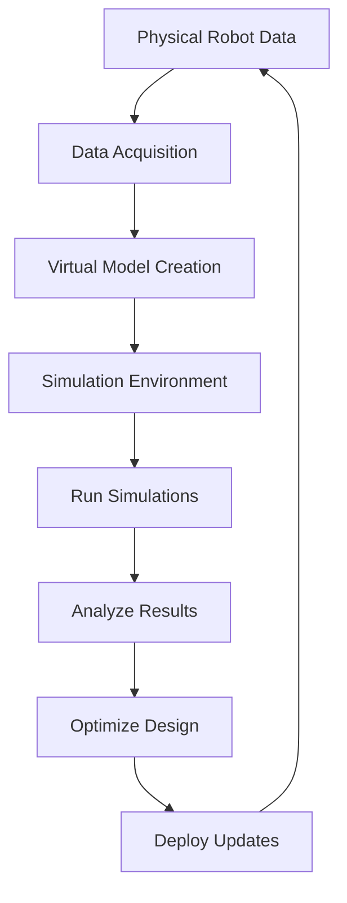

# Chapter 04: Digital Twin Simulation

## Introduction

A digital twin is a virtual representation of a physical object, system, or process that mirrors its real-world counterpart in real-time. In robotics, digital twin simulation enables engineers to model, test, and optimize humanoid robots before physical prototyping, reducing costs and risks.

Digital twins integrate data from sensors, IoT devices, and simulations to provide predictive insights. As of 2023, advancements in AI and cloud computing have made digital twins more accessible, with applications in manufacturing, healthcare, and autonomous systems.

## Components of a Digital Twin

A digital twin consists of four key components:

1. **Physical Entity**: The real-world humanoid robot or system.
2. **Virtual Model**: A digital replica built using CAD software, physics engines, and AI models.
3. **Data Connection**: Real-time data flow via sensors, APIs, and IoT platforms.
4. **Analytics and Simulation**: Tools for running simulations, analyzing performance, and predicting outcomes.

## Role in Humanoid Robotics

In humanoid robotics, digital twins simulate complex interactions like walking, grasping, and navigation. They allow for:

- **Design Optimization**: Iterating on robot morphology and control algorithms.
- **Safety Testing**: Simulating hazardous scenarios without physical risk.
- **Training AI**: Using simulated environments to train reinforcement learning models.

For example, NVIDIA Isaac Sim provides physics-based simulations for humanoid robots, integrating with ROS2 for seamless development.

## Simulation Tools Comparison

| Tool          | Key Features                  | Best For                  | Open Source |
|---------------|-------------------------------|---------------------------|-------------|
| Gazebo       | Physics simulation, ROS integration | General robotics         | Yes         |
| NVIDIA Isaac Sim | AI-driven simulation, photorealistic rendering | Humanoid and autonomous systems | No          |
| Webots       | Multi-robot simulation, Python API | Educational and research | Yes         |
| MuJoCo       | Fast dynamics, reinforcement learning | Agile robotics           | Yes         |

## Digital Twin Workflow

The process of creating and using a digital twin follows this flow:

This iterative loop ensures continuous improvement of the humanoid robot.

## Benefits and Challenges

**Benefits**:
- Reduced development time and costs.
- Enhanced safety through virtual testing.
- Predictive maintenance and performance monitoring.

**Challenges**:
- High computational requirements for real-time simulations.
- Data privacy and security concerns.
- Ensuring model accuracy with real-world discrepancies.

## Conclusion

Digital twin simulation is transforming humanoid robotics by bridging the gap between virtual and physical worlds. As technologies like 5G and edge computing evolve, digital twins will become even more integral to next-generation robotics. For hands-on practice, explore ROS2 simulations in the following chapters.
