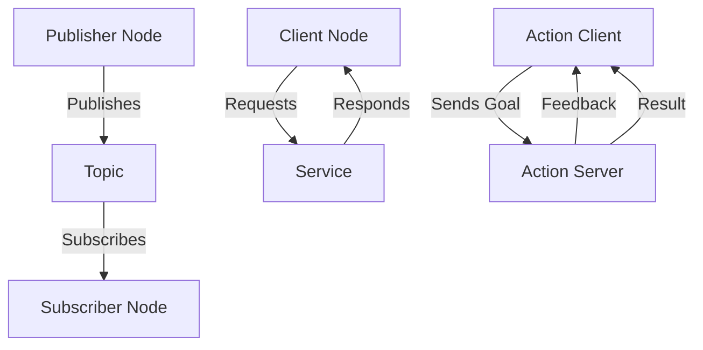

# Chapter 03: ROS 2 Fundamentals of Robotics

## Introduction

ROS 2 (Robot Operating System 2) is an open-source framework for building robot applications. It provides tools, libraries, and conventions to simplify the development of complex robot software. Released in 2017, ROS 2 addresses limitations of ROS 1, such as real-time capabilities, multi-robot systems, and cross-platform support.

Key features of ROS 2 include:
- **Distributed Architecture**: Supports multiple robots and systems communicating seamlessly.
- **Real-Time Performance**: Uses DDS (Data Distribution Service) for efficient, low-latency communication.
- **Security**: Built-in security features for authentication and encryption.
- **Cross-Platform**: Runs on Linux, Windows, macOS, and embedded systems.

## Architecture Overview

ROS 2 follows a modular architecture based on nodes, topics, services, and actions. This design promotes reusability and scalability.

### Core Concepts

| Concept | Description | Example |
|---------|-------------|---------|
| **Node** | Executable processes that perform computations | A node for controlling a robot arm |
| **Topic** | Communication channels for publishing/subscribing data | Publishing sensor data |
| **Service** | Synchronous request-response communication | Requesting a robot's current position |
| **Action** | Asynchronous goal-oriented tasks | Navigating to a waypoint |
| **Parameter** | Configuration values for nodes | Setting motor speeds |

### Communication Flow



*Figure 1: ROS 2 Communication Architecture*

## DDS Middleware

ROS 2 uses DDS as its underlying middleware for communication. DDS provides:
- **Decoupling**: Publishers and subscribers don't need to know each other.
- **Quality of Service (QoS)**: Configurable reliability, durability, and latency.
- **Discovery**: Automatic node discovery in the network.


*Figure 2: DDS Middleware in ROS 2*

## Key Tools and Interfaces

### RViz
RViz is a 3D visualization tool for ROS 2 applications. It allows developers to visualize robot models, sensor data, and environment maps.

### Gazebo
Gazebo is a simulation environment integrated with ROS 2 for testing robot behaviors in virtual worlds.

### Launch Files
Launch files (XML or Python) define how to start multiple nodes and configure their parameters.

Example launch file (Python):
```python
from launch import LaunchDescription
from launch_ros.actions import Node

def generate_launch_description():
    return LaunchDescription([
        Node(
            package='turtlesim',
            executable='turtlesim_node',
            name='sim'
        ),
        Node(
            package='turtlesim',
            executable='turtle_teleop_key',
            name='teleop',
            prefix='xterm -e'
        ),
    ])
```

## Differences from ROS 1

| Aspect | ROS 1 | ROS 2 |
|--------|-------|-------|
| Middleware | Custom TCP/UDP | DDS |
| Real-time | Limited | Supported |
| Security | None | Built-in |
| Multi-robot | Challenging | Native support |
| Language Support | C++, Python | C++, Python, Rust, etc. |

## Getting Started with ROS 2

1. **Installation**: Download ROS 2 Humble Hawksbill (latest LTS as of 2023).
2. **Workspace Setup**: Create a ROS 2 workspace with `colcon`.
3. **Package Creation**: Use `ros2 pkg create` to start new projects.
4. **Building**: Compile with `colcon build`.
5. **Running**: Launch nodes with `ros2 run` or launch files.

## Best Practices

- Use QoS policies to optimize communication for your use case.
- Implement lifecycle management for nodes.
- Leverage ROS 2's security features for production deployments.
- Test in simulation before deploying to hardware.

## Conclusion

ROS 2 provides a robust foundation for modern robotics development. Its modular architecture, real-time capabilities, and extensive tooling make it suitable for a wide range of applications from autonomous vehicles to industrial automation.

For more information, visit the [official ROS 2 documentation](https://docs.ros.org/en/humble/).
