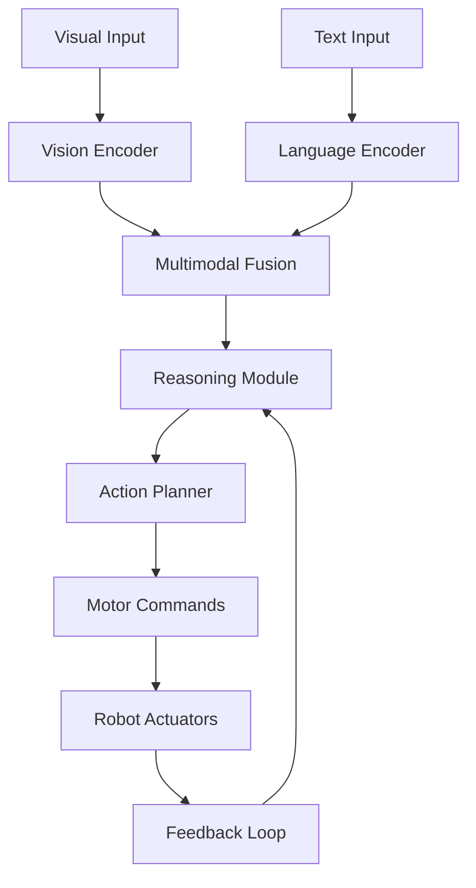

# Chapter 05: Vision-Language-Action Systems

## Introduction

Vision-Language-Action (VLA) systems integrate computer vision, natural language processing, and robotic control to enable robots to perceive, understand, and act based on visual and textual inputs. In humanoid robotics, VLA systems allow robots to interpret human commands, recognize objects, and perform tasks in dynamic environments. As of 2024, advancements in multimodal large language models (e.g., GPT-4V, RT-2) have made VLA systems more capable, bridging the gap between perception and action.

*Figure 1: Overview of a Vision-Language-Action system in a humanoid robot.*

## Core Components of VLA Systems

VLA systems combine three key modalities:

- **Vision**: Computer vision models process images and videos to detect objects, scenes, and gestures.
- **Language**: NLP models interpret and generate text, enabling natural human-robot interaction.
- **Action**: Control algorithms translate decisions into physical movements via actuators.

These components are integrated through multimodal architectures that align visual, textual, and motor representations.

### Vision Module

Uses convolutional neural networks (CNNs) or vision transformers (ViTs) for tasks like object detection, segmentation, and pose estimation. Recent models like CLIP enable zero-shot recognition by aligning images with text embeddings.

### Language Module

Leverages large language models (LLMs) for understanding commands, generating responses, and reasoning. Models like BERT or GPT handle semantic parsing and context-aware dialogue.

### Action Module

Involves inverse kinematics, reinforcement learning, and motor control to execute tasks. In humanoids, this includes grasping, walking, and manipulation.

## Integration and Architecture

VLA systems use end-to-end training or modular pipelines. A common architecture includes:

1. Multimodal encoding (vision + language).
2. Decision-making (reasoning and planning).
3. Action execution (control and feedback).

*Flow Diagram 1: VLA system pipeline from perception to action.*

## Applications in Humanoid Robotics

- **Task Execution**: Robots follow verbal instructions like "pick up the red ball and place it on the shelf."
- **Human-Robot Interaction**: Gesture recognition combined with speech for collaborative tasks.
- **Autonomous Navigation**: Vision-guided path planning with language-based goal specification.

## Comparison: Traditional vs. VLA Systems

| Aspect | Traditional Robotics | VLA Systems |
|--------|----------------------|-------------|
| Input Modality | Sensors only | Vision + Language |
| Decision Making | Rule-based | AI-driven reasoning |
| Flexibility | Limited to programmed tasks | Adaptable to new commands |
| Human Interaction | Buttons/interfaces | Natural language |
| Examples | Industrial arms | Humanoid assistants |

## Challenges and Future Directions

Challenges include grounding language to physical actions, handling ambiguous inputs, and ensuring safety in real-world deployments. Future trends involve scaling with larger models, real-time processing, and ethical AI for humanoids.

## Case Study: Google's RT-2

RT-2 (Robotics Transformer 2) is a VLA model trained on web-scale data, enabling robots to perform tasks from text descriptions. It demonstrates zero-shot generalization, such as a robot learning to open a drawer from online videos.

*Figure 2: A humanoid robot using VLA for object manipulation.*

## Chapter Summary

### Key Takeaways

- VLA systems fuse vision, language, and action for intelligent robotics.
- Components: Vision encoders, LLMs, action planners.
- Applications: Task execution, interaction, navigation.
- Challenges: Grounding, ambiguity, safety.

### Review Questions

1. What are the three core components of a VLA system?
2. How does multimodal fusion work in VLA?
3. Compare traditional robotics with VLA systems.
4. What is RT-2, and why is it significant?
5. Challenges in deploying VLA in humanoids.

### Mini Project Idea

Build a simple VLA demo: Use a camera to detect objects, process text commands with an LLM, and control a simulated robot arm to grasp the object.
